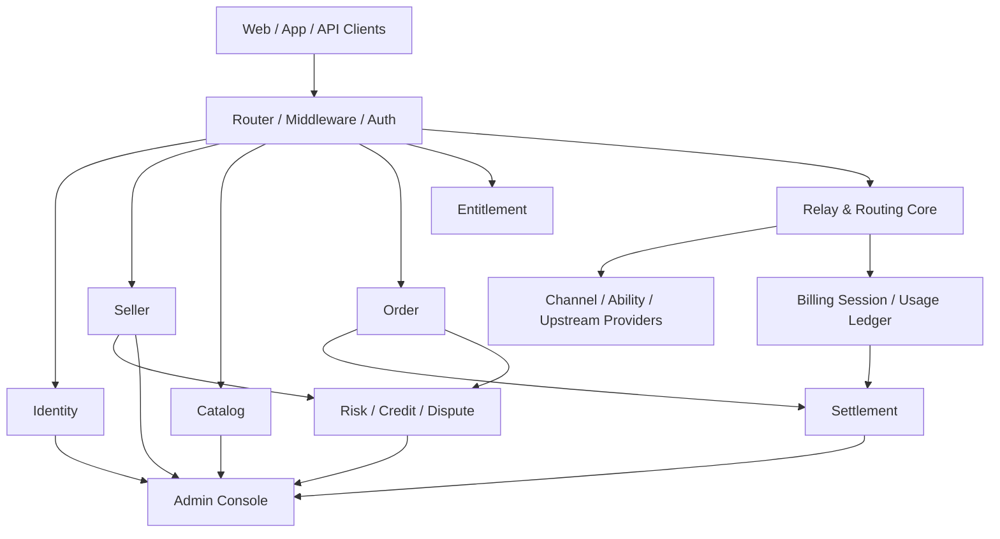

# 07-ClawTeam 基于 new-api-main 的完整实施蓝图

更新时间：2026-04-11

## 1. 直接结论

这件事不应继续定义成“去中心化 AI Token 二级市场”，而应明确为：

`以 new-api-main 为系统底座的平台代理型 AI 使用权交易平台`

这一定义必须先写死，原因很简单：

- 平台对外售卖的是“可消费权益”，不是卖家原始 API Key
- 买方只能拿到平台 `Client Key`，所有请求必须经平台代理
- 平台必须承担密钥托管、统一 relay、统一计费、统一结算、统一仲裁
- 一旦这里不固定，商品、账务、风控、法务边界都会反复摇摆

推荐结论如下：

- 主底座：`new-api-main`
- 技术路线：`模块化单体 + 统一 Relay 内核 + 异步账务/结算流水`
- 一期范围：`MVP-Lite`
- 一期能力：白名单卖家、人工审核、固定价商品、平台托管密钥、买方权益池、平台代理调用、人工争议、冻结结算
- 一期明确不做：竞价、保险、自动仲裁、复杂促销、卖家自助提现、开放自由市场
- 现实周期：`10-13 周` 做出收口后的 MVP；`16-24 周` 才适合推进到 Marketplace V1

## 2. ClawTeam 团队分工与结论

本轮采用四个并行角色做交叉分析，再由主方案统一收敛：

| 角色 | 核心结论 |
| --- | --- |
| 产品分析 | 平台核心价值不是“撮合”，而是“平台信用 + 统一接入 + 账务结算 + 风险兜底”；需求文档中存在明显过度设计 |
| 架构设计 | 不建议另起一套系统，也不建议先拆微服务；应在 `new-api-main` 内做分域扩展 |
| 底座适配 | `new-api-main` 已具备用户、网关、支付、日志、后台底座，但缺少 marketplace 交易域 |
| 交付与运维 | 首版最大风险不是技术难度，而是范围失控、账务建模错误、合规前置不足 |

统一后的总判断：

1. `new-api-main` 适合做“AI 调用网关底座 + 用户中心底座 + 支付计费底座 + 管理后台底座”。
2. marketplace 需要在其上新增独立业务域，而不是让 `Channel`、`Token` 直接充当商品和订单。
3. 真正该复用的是现有 `User / Token / Channel / Ability / Relay / Log / TopUp / Subscription / Web Admin`。
4. 真正需要新增的是 `seller / catalog / inventory / order / entitlement / settlement / risk / dispute`。

## 3. 一期必须冻结的业务规则

以下规则建议作为项目启动 Gate，先写入方案，再允许进入详细设计与编码：

1. 平台售卖的是“使用权/权益”，不是卖家原始 API Key。
2. 买方永远只拿平台 `Client Key`，所有请求必须经过平台代理。
3. 一期卖家准入只能是：`白名单 + 人工审核 + 平台托管密钥`。
4. 一期商品类型只能是：`固定价标准商品`，不做竞价、组合包、自动调价。
5. 支付成功后不能直接给用户增加通用余额，必须生成买方 `entitlement`。
6. 权益扣减顺序建议固定为：`同模型优先 + 先到期先用 + 同商品 FIFO`。
7. 账务必须分成四层：`供给账 / 权益账 / 用量账 / 结算账`。
8. relay 必须采用：`预扣 + 实扣 + 失败退款/修正`，不能只做一次性扣减。
9. 结算必须延迟发生，建议保留 `保障期冻结 + 争议冻结`。
10. 历史流水不允许手改，只允许通过补偿流水修正。
11. 商品“可售库存”不能简单等于卖家声明余额，必须是平台认可后的可售值。
12. 支付回调、权益创建、usage 入账、结算出账都必须有幂等键。
13. 一期争议裁决必须归平台人工处理，不能承诺自动仲裁。
14. 若上游供应商条款不允许 resale 或 delegation，对应供给不得上架。
15. 集市核心账本不得使用 `float64` 金额模型，统一使用整型金额单位。

## 4. 为什么主底座选 new-api-main

### 4.1 已有能力

`new-api-main` 已经具备本项目最难复制的基础设施层：

- 用户与身份：`model/user.go`、`controller/oauth.go`、`controller/passkey.go`、`controller/twofa.go`
- 平台 Token 与权限：`model/token.go`
- 上游供给运行时对象：`model/channel.go`、`model/ability.go`
- 统一 Relay 与多上游兼容：`router/relay-router.go`、`controller/relay.go`、`relay/channel/*`
- 请求日志与使用证据：`model/log.go`
- 充值、支付、订阅底座：`model/topup.go`、`model/subscription.go`、`controller/topup*.go`、`controller/subscription*.go`
- 计费预扣与结算会话：`service/billing_session.go`、`service/funding_source.go`
- 管理后台表格体系：`web/src/components/table/*`
- 多数据库兼容与统一迁移入口：`model/main.go`

### 4.2 不足之处

它缺的不是网关，而是交易域：

- 没有卖家域
- 没有商品/SKU 域
- 没有买方资产/权益域
- 没有集市订单与双边账务域
- 没有结算/提现/争议/信用分域

### 4.3 正确的改造方式

不是“把 `Channel` 直接当商品”，而是：

- `Channel / Ability` 继续做运行时路由对象
- marketplace 新增一层交易域，把商品、订单、权益、结算、争议独立出来
- 交易域最终把“可消费权益”编译成“可以被 Relay 选择的候选 Channel 池”

## 5. 底座映射：复用、扩展与新增

| 子系统 | 直接复用 | 需要扩展 | 必须新增 |
| --- | --- | --- | --- |
| 用户中心 | `model/user.go`、OAuth、2FA、Passkey、RBAC | 实名等级、买卖家标签、交易限额 | 企业认证、支付密码、设备管理 |
| 卖家供给 | `model/channel.go`、`model/ability.go`、`controller/channel*.go` | 将 seller supply 绑定到 channel | `seller_profile`、`supply_account`、`inventory_snapshot` |
| 商品市场 | `model/pricing.go`、`model/model_meta.go`、现有前端表格骨架 | 用模型/厂商/价格元数据支撑商品展示 | `listing`、`listing_sku`、店铺、收藏、评价 |
| 代理路由 | `router/relay-router.go`、`controller/relay.go`、`service/channel_select.go` | 接入 entitlement 约束、卖家责任归属 | 资产绑定路由规则、订单约束选路 |
| 计费结算 | `service/billing_session.go`、`model/log.go`、`model/topup.go`、`model/subscription.go` | 把平台单边计费改为双边账务 | `buyer_entitlement`、`usage_ledger`、`settlement_entry`、提现 |
| 风控信用 | 限流、2FA、日志、channel 验活/封禁 | 规则化告警与卖家异常识别 | `risk_event`、`credit_score_snapshot`、黑灰名单 |
| 争议仲裁 | `Log` 作为请求证据基础 | 后台表格可复用 | `dispute_case`、`dispute_evidence`、`dispute_decision` |
| 后台前端 | `web/src/components/table/*` | 复用 Filters/Actions/ColumnDefs/modals 模式 | listings/orders/settlements/disputes/sellers 模块 |

## 6. 目标架构

### 6.1 推荐架构形态

推荐采用：

`模块化单体 + 统一 Relay 内核 + 异步任务驱动的账务/结算流水`

不建议第一阶段直接引入：

- 微服务拆分
- Kong 作为独立前置网关
- Kafka 作为硬依赖
- MongoDB / MinIO / 多数据库混搭

原因：

- 当前最大的风险是领域建模错误，不是服务拆分不够
- 订单、权益、用量、结算、争议天然强耦合
- `new-api-main` 已经提供单体分层与运行时内核
- 本项目必须同时兼容 SQLite / MySQL / PostgreSQL，拆早了会显著提高实现复杂度

### 6.2 逻辑模块图

### 6.3 模块边界

- `identity`
  - 复用现有用户、角色、认证、2FA、Passkey、审计
- `seller`
  - 卖家资料、KYC、店铺、保证金、结算账户
- `catalog`
  - 商品、SKU、价格策略、保障等级、审核流
- `inventory`
  - 卖家供给、库存快照、健康状态、可售库存、冻结库存
- `order`
  - 购物车、订单、支付、退款、冻结金额
- `entitlement`
  - 买家权益总账与批次账
- `relay_metering`
  - 继续使用 `Channel/Ability/Relay` 做运行时路由，并接入权益扣减
- `settlement_risk_dispute`
  - 待结算、解冻、提现、信用分、异常事件、争议工单

## 7. 核心数据模型设计

### 7.1 继续复用的核心实体

- `User`
- `Token`
- `Channel`
- `Ability`
- `Log`
- `TopUp`
- `SubscriptionPlan / SubscriptionOrder / UserSubscription`
- `Task`

### 7.2 一期建议新增的实体

| 实体 | 用途 | 一期是否必须 |
| --- | --- | --- |
| `seller_profile` | 卖家身份、认证状态、风控等级、保证金余额 | 是 |
| `seller_store` | 店铺信息、展示文案、运营状态 | 否，建议一期合并进 `seller_profile` |
| `supply_account` | 卖家供给单元，不直接暴露原始密钥 | 是 |
| `supply_channel_binding` | 把供给单元绑定到运行时 `channel_id` | 是 |
| `listing` | 商品主表 | 是 |
| `listing_sku` | 商品销售规格 | 是 |
| `inventory_snapshot` | 可售库存、冻结库存、风险折扣、最近校验时间 | 是 |
| `market_order` | 订单主表 | 是 |
| `market_order_item` | 订单明细表 | 是 |
| `buyer_entitlement` | 买家权益总账 | 是 |
| `entitlement_lot` | 买家权益批次账，支持 FIFO 消耗与回滚 | 是 |
| `usage_ledger` | 每次请求的真实消耗流水 | 是 |
| `settlement_statement` | 卖家待结算/已结算汇总 | 否，M2 建议 |
| `settlement_entry` | 与订单、usage 绑定的结算明细 | 是 |
| `withdrawal_request` | 提现申请 | 否，V1 再做 |
| `risk_event` | 异常事件与风控动作 | 是 |
| `credit_score_snapshot` | 信用分快照 | 否，M2 建议 |
| `dispute_case` | 争议工单 | 是 |
| `dispute_evidence` | 争议证据 | 是 |
| `dispute_decision` | 裁决结果 | 是 |

### 7.3 状态机建议

- `listing.status`
  - `draft -> pending_review -> active -> paused -> sold_out -> archived`
- `market_order.status`
  - `pending_payment -> paid -> entitlement_created -> active -> partially_consumed -> completed -> disputed -> refunded -> closed`
- `settlement_entry.status`
  - `pending -> frozen -> releasable -> settled -> withheld -> reversed`
- `dispute_case.status`
  - `open -> seller_responding -> under_review -> decided -> executed -> closed`

### 7.4 数据设计原则

- `Channel` 保持“运行时路由对象”职责，不把订单、结算、争议字段直接塞进 `channels`
- 买方永远只看到平台 `Token`，不接触卖方原始 Key
- “库存”按可售值管理，不按卖家声称余额直接售卖
- 核心市场账本金额统一使用整型，不再沿用 `float64` 作为集市账本金额
- 可选参数 DTO 使用指针类型，避免零值被 `omitempty` 吞掉
- JSON 存储优先用 `TEXT`，通过 `common.Marshal/Unmarshal` 处理，不引入 `JSONB` 依赖

## 8. 核心流程设计

### 8.1 卖家上架流程

1. 卖家提交入驻资料
2. 平台完成 KYC/白名单审核
3. 卖家录入上游供给，系统创建 `supply_account`
4. 平台把供给单元绑定到 `Channel`
5. 执行 key 可用性、模型能力、余额/配额探测
6. 生成 `inventory_snapshot`
7. 运营审核通过后创建 `listing/listing_sku`
8. 商品进入 `active`

### 8.2 买家购买流程

1. 买家浏览商品并下单
2. 系统锁定对应库存
3. 支付成功
4. 创建 `market_order / market_order_item`
5. 生成 `buyer_entitlement / entitlement_lot`
6. 买家继续使用平台 `Token` 访问统一 API

### 8.3 API 调用与计费流程

1. 校验买方 `Token`
2. 查询当前用户可用的 `entitlement_lot`
3. 根据 entitlement 约束筛选可用 `Channel`
4. 走现有 relay 转发请求
5. 通过 `service/billing_session.go` 做预扣/实扣/失败退款
6. 写入 `Log + usage_ledger`
7. 更新 `entitlement_lot` 已用量
8. 生成或更新卖家 `settlement_entry`

### 8.4 退款与争议流程

1. 买方发起争议或退款申请
2. 系统冻结关联 `settlement_entry`
3. 平台关联 `order_id + request_id + usage_ledger + Log`
4. 卖家提交回应
5. 平台人工裁决
6. 执行退款/补偿/扣分/解冻

## 9. 在 new-api-main 中的落地方式

### 9.1 后端文件级落点建议

建议沿用现有平铺式分层，不强行新建复杂子模块目录：

#### Model 层

- 新增 `model/seller_profile.go`
- 新增 `model/supply_account.go`
- 新增 `model/listing.go`
- 新增 `model/market_order.go`
- 新增 `model/entitlement.go`
- 新增 `model/settlement.go`
- 新增 `model/dispute.go`
- 在 `model/main.go` 中注册迁移入口

#### Controller 层

- 新增 `controller/seller.go`
- 新增 `controller/listing.go`
- 新增 `controller/market_order.go`
- 新增 `controller/entitlement.go`
- 新增 `controller/settlement.go`
- 新增 `controller/dispute.go`
- 在 `router/api-router.go` 中新增买方、卖方、平台管理方接口

#### Service 层

- 新增 `service/seller_service.go`
- 新增 `service/listing_service.go`
- 新增 `service/entitlement_service.go`
- 新增 `service/market_order_service.go`
- 新增 `service/settlement_service.go`
- 新增 `service/dispute_service.go`
- 新增 `service/inventory_sync_task.go`
- 新增 `service/settlement_task.go`
- 新增 `service/dispute_timeout_task.go`

### 9.2 对现有运行时内核的最小侵入点

以下文件建议只做“插点式改造”，不要重写：

- `controller/relay.go`
  - 在选路前接入 entitlement 上下文
  - 在成功/失败回调时写 usage 与补偿流水
- `service/channel_select.go`
  - 增加“候选 Channel 受 entitlement/supply 约束”的筛选能力
- `service/billing_session.go`
  - 保留现有预扣/实扣/退款模型，但增加 entitlement 与 settlement 联动
- `model/log.go`
  - 在 `other` 或新增字段中挂 `seller_id / listing_id / order_id / entitlement_lot_id`
- `service/log_info_generate.go`
  - 增补市场域上下文，方便对账与争议取证

### 9.3 前端落点建议

前端建议复用现有 `web/src/components/table/*` 组织模式：

- 新增 `web/src/components/table/sellers/*`
- 新增 `web/src/components/table/listings/*`
- 新增 `web/src/components/table/orders/*`
- 新增 `web/src/components/table/entitlements/*`
- 新增 `web/src/components/table/settlements/*`
- 新增 `web/src/components/table/disputes/*`

每个模块延续现有结构：

- `index.jsx`
- `*Filters.jsx`
- `*Actions.jsx`
- `*ColumnDefs.jsx`
- `modals/*`

这样能最大限度复用现有后台表格、分页、查询、弹窗交互心智。

## 10. 分阶段实施计划

### 10.1 M0：方案冻结（1-2 周）

目标：

- 冻结业务定义
- 冻结数据模型
- 冻结一期范围
- 冻结账务原则

输出：

- 本实施蓝图
- 主实体定义
- 状态机定义
- 一期不做清单

退出标准：

- 不再讨论“是否还要换底座”
- 不再讨论“是否一期上竞价/保险/微服务”

### 10.2 M1：交易闭环（3-4 周）

目标：

- 卖家入驻与审核
- 商品上架与审核
- 下单支付与权益生成
- 通过平台 API 消费已购权益

输出：

- `seller + listing + order + entitlement` 最小闭环
- 自动停售能力
- 基础后台页面

退出标准：

- 买家完成“选商品 -> 支付 -> 获得权益 -> 调用成功”完整闭环
- 任一请求可以追溯到商品、订单、卖家、请求日志

### 10.3 M2：清结算与风控（3-4 周）

目标：

- 待结算账务
- 保障期冻结
- 人工争议闭环
- 基础风控规则

输出：

- `usage_ledger + settlement_entry + dispute_case + risk_event`
- 幂等回调与补偿流水
- 平台运营处理流程

退出标准：

- 重复/乱序回调不重复记账
- 退款、争议、冻结、解冻可以闭环
- 对账脚本能验证账平

### 10.4 M3：灰度与运维加固（2-3 周）

目标：

- 白名单卖家灰度
- 对账、压测、异常演练
- 监控、告警、运营 SOP

输出：

- Pilot 试运行环境
- 演练报告
- 回滚与止损方案

退出标准：

- 日清对账
- 告警可触发
- 卖家异常可在 5 分钟内止损

## 11. 测试、运维与合规方案

### 11.1 测试重点

- 接口兼容测试：OpenAI / Claude / Gemini 兼容接口、SSE、失败重试、通道切换
- 账务测试：支付回调幂等、重复/乱序回调、部分退款、争议退款、冻结与解冻
- 数据库兼容测试：SQLite / MySQL / PostgreSQL 全覆盖
- 故障注入测试：卖家 Key 失效、余额突降、流式中断、Redis 不可用、DB 锁冲突
- 压测：分开压 `relay TPS` 与 `交易/账务 TPS`

### 11.2 监控指标

- 基础设施：CPU、内存、磁盘、DB 连接池、Redis、Goroutine、GC
- 应用层：relay 成功率、P95/P99、重试次数、SSE 中断率、Webhook 失败率
- 业务层：商品审核积压、支付成功率、权益发放成功率、自动停售次数、争议单量
- 资金层：对账差额、账本不平、退款超时、卖家负应收、结算积压

### 11.3 告警建议

- 5 分钟 relay 失败率 `> 3%`：P1
- P99 延迟高于基线 `2 倍`：P2
- 某卖家 Key 健康失败率 `> 10%`：P1
- 对账差额 `!= 0`：立即 P1
- 结算积压 `> 30 分钟`：P1

### 11.4 合规与安全

- 卖家 API Key 视为高价值密钥，必须加密存储、最小权限、访问审计、日志脱敏
- 卖家来源、条款允许范围、税务与发票、跨境支付、数据留存必须在 M0 前确认
- 平台“看订单”和“接触明文密钥”权限必须隔离
- 买家绕过平台直连卖家不在平台责任边界内

## 12. 关键风险与最容易踩坑的地方

### 12.1 高风险

- 把“用户钱包余额”直接当“卖家可结算金额”
- 让买家直接拿卖家 Key
- 用 `float64` 做集市账本
- 做跨卖家自动路由，却没有 entitlement 与责任归属
- 忽视三数据库兼容
- 只测 happy path，不测支付回放、乱序、流式中断、部分退款

### 12.2 不建议首期进入范围

- 自由竞价
- 保险服务
- 自动仲裁
- 卖家自助提现
- 多币种
- 复杂促销
- 开放平台
- 企业级团队/预算/Guardrails

## 13. 建议团队配置

最少建议配置：

- 1 名技术负责人 / 架构负责人
- 2 名 Go 后端工程师
- 1 名前端或全栈工程师
- 1 名测试 / 自动化工程师
- 1 名产品 / 运营负责人

如果研发少于 4 人，建议只做 `MVP-Lite`，不要承诺完整 Marketplace V1。

## 14. 下一步建议

建议按以下顺序推进：

1. 以本文件作为实施主文档
2. 在此基础上冻结 `seller / listing / entitlement / settlement / dispute` 数据模型
3. 明确一期白名单卖家与合规边界
4. 把 M1 所需接口与页面清单单独拆成开发任务书
5. 在 `new-api-main` 中进入第一阶段实现

一句话总结：

`new-api-main` 不是完整集市，但它已经是一块非常好的“网关与平台基础设施底座”；正确做法不是推翻它，而是在它之上长出一层交易平台领域。`
