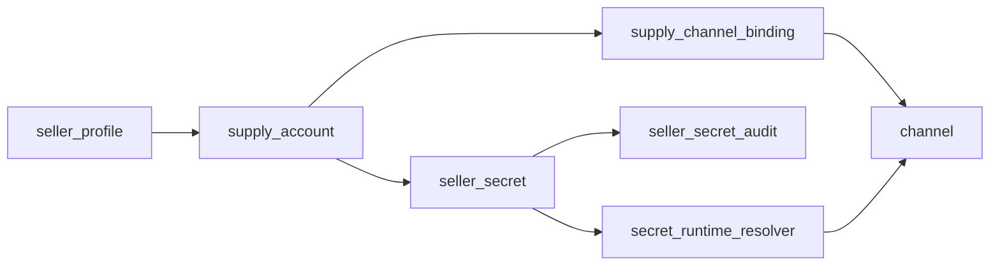
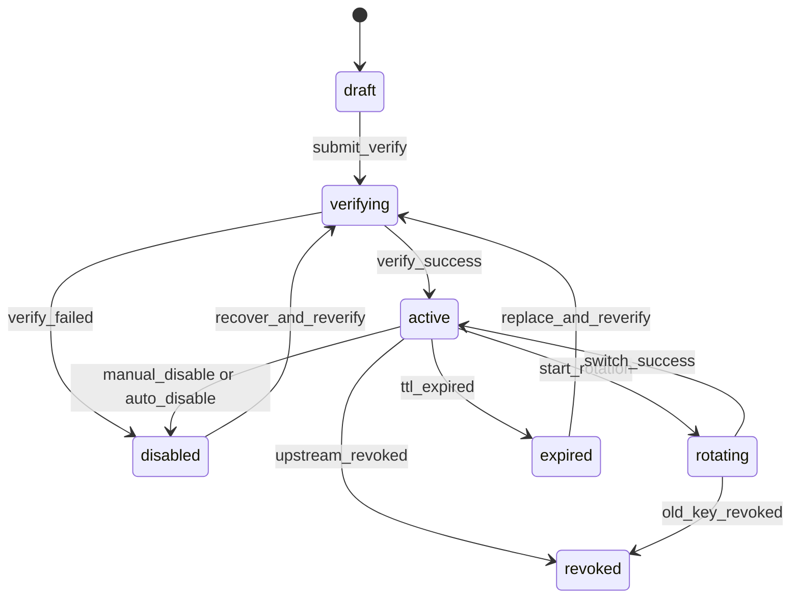

# 11-SellerKeyVault 与密钥生命周期设计

更新时间：2026-04-11

## 1. 文档目标

本文件将 `AI Token 集市平台` 中卖家原始上游凭证的存储、解密、使用、轮换、封禁、恢复与审计方案冻结到“可指导编码”的粒度。

本文件要解决的不是“是否需要密钥仓”，而是下面这些实现问题：

1. `seller_secret` 是否必须独立于 `channels.key`
2. 密文、掩码、指纹、审计记录分别存在哪里
3. relay 运行时如何拿到凭证，哪些人可以看明文
4. 如何兼容 `new-api-main` 现有 `Channel` 模型与后台能力
5. 如何从当前 `channels.key` 平滑迁移到卖家密钥主事实源

## 2. 现状约束与设计结论

## 2.1 与现有仓库的真实边界

当前 `new-api-main` 已有这些敏感字段处理习惯：

- `model.Channel.Key` 仍是渠道真实凭证字段
- 大部分列表与普通查询通过 `Omit("key")` 隐藏密钥
- `controller.GetChannelKey` 需要 `RootAuth + SecureVerificationRequired`
- 渠道状态更新大量依赖 `SaveWithoutKey`

这说明现有底座已经有“敏感字段默认不返回、明文读取要升级验证”的基本能力，但还没有“卖家凭证主事实源”和“密钥生命周期域模型”。

## 2.2 本文冻结的 4 个关键决策

### 决策 A：`seller_secret` 必须新建，且成为主事实源

- 卖家上游凭证不再以 `channels.key` 作为唯一真实来源
- `channels.key` 在 `M1` 允许保留为运行时镜像字段
- 与卖家供给相关的真实凭证一律先写入 `seller_secret`

### 决策 B：`M1` 不引入外部 Vault，先做应用层字段加密

- 一期采用“数据库密文 + 应用层统一加解密服务”
- 主密钥来自环境变量
- 二期再演进到 KMS / Vault

### 决策 C：默认无人可直接查看明文，明文读取走 Break-Glass

- 买方永远不可见
- 普通卖家不可见
- 平台管理员默认不可见
- 只有 `RootAuth + SecureVerificationRequired + reason` 才能做一次性明文读取

### 决策 D：relay 读取明文只允许发生在服务端内存中

- 明文不落日志
- 明文不经前端透传
- 明文不写回审计表
- 明文不进入普通缓存

## 3. 设计范围

## 3.1 一期支持

- 卖家 API Key / OAuth Token / JSON 凭证入库
- 字段级加密与脱敏展示
- 供给单元与密钥绑定
- 明文读取审计
- 验活、禁用、恢复、轮换
- 与 `Channel` 的运行时镜像同步

## 3.2 一期不支持

- 外部 KMS / Vault 强依赖
- HSM
- 跨区域密钥主备
- 多租户独立主密钥
- 卖家自助导出明文

## 4. 领域对象与关系



关系定义：

- 一个 `seller_profile` 可拥有多个 `supply_account`
- 一个 `supply_account` 在 `M1` 只允许一个 `active` 主密钥，可保留一个 `rotating` 旧密钥
- 一个 `supply_account` 可绑定多个 `channel`
- `channel` 继续承担现有 relay 接入职责，但不再是卖家原始凭证的唯一事实源

## 5. 表结构冻结

说明：

- 主键统一 `Id int`
- 时间统一 `int64` Unix 秒
- JSON 一律存 `TEXT`
- 兼容 `SQLite / MySQL / PostgreSQL`
- JSON 序列化统一通过 `common.Marshal / common.Unmarshal`

## 5.1 `seller_secret`

用途：

- 保存卖家敏感凭证的密文、展示掩码、校验结果和生命周期状态

建议字段：

| 字段 | 类型 | 说明 |
| --- | --- | --- |
| `Id` | `int` | 主键 |
| `SellerId` | `int` | 关联 `seller_profile.id` |
| `SupplyAccountId` | `int` | 关联 `supply_account.id` |
| `SecretType` | `string` | `api_key/oauth_token/service_account/json_blob` |
| `ProviderCode` | `string` | `openai/anthropic/gemini/...` |
| `Ciphertext` | `string` | 密文包，JSON 文本 |
| `CipherVersion` | `string` | 加密版本，如 `v1` |
| `Fingerprint` | `string` | HMAC 指纹，不可逆 |
| `MaskedValue` | `string` | 后台展示用脱敏值 |
| `Status` | `string` | `draft/verifying/active/rotating/disabled/revoked/expired` |
| `VerifyStatus` | `string` | `pending/success/failed/partial` |
| `LastVerifiedAt` | `int64` | 最近验证时间 |
| `LastUsedAt` | `int64` | 最近运行时使用时间 |
| `LastRotationAt` | `int64` | 最近轮换时间 |
| `ExpiresAt` | `int64` | 凭证失效时间，可空或 0 |
| `DisabledReason` | `string` | 禁用原因 |
| `VerifyMessage` | `string` | 最近验活摘要 |
| `Meta` | `string` | JSON，保存结构化扩展信息 |
| `CreatedAt` | `int64` | 创建时间 |
| `UpdatedAt` | `int64` | 更新时间 |

`Meta` 推荐内容：

- `channel_format`
- `oauth_account_id`
- `secret_schema`
- `import_source`
- `managed_by`
- `rotation_from_secret_id`
- `rotation_batch_no`

索引建议：

- 唯一索引：`supply_account_id + fingerprint`
- 普通索引：`seller_id`
- 普通索引：`supply_account_id`
- 普通索引：`status`
- 普通索引：`verify_status`
- 普通索引：`provider_code`

一期业务约束：

- 同一 `supply_account_id` 同时最多允许 1 条 `status=active`
- 同一 `supply_account_id` 最多允许 1 条 `status=rotating`
- `revoked/expired/disabled` 不允许参与上架与 relay

## 5.2 `seller_secret_audit`

用途：

- 保存每次敏感操作的操作人、动作、原因、结果和关联请求

建议字段：

| 字段 | 类型 | 说明 |
| --- | --- | --- |
| `Id` | `int` | 主键 |
| `SellerSecretId` | `int` | 关联 `seller_secret.id` |
| `SellerId` | `int` | 冗余卖家 ID，便于检索 |
| `SupplyAccountId` | `int` | 冗余供给 ID，便于检索 |
| `ActorUserId` | `int` | 操作用户 ID，系统任务可为 0 |
| `ActorType` | `string` | `system/admin/root/task` |
| `Action` | `string` | `create/update/verify_success/verify_failed/reveal/rotate/disable/recover/revoke/sync_channel` |
| `Reason` | `string` | 操作原因 |
| `RequestId` | `string` | 关联请求号 |
| `Ip` | `string` | 操作 IP，可空 |
| `Result` | `string` | `success/failed/rejected` |
| `Meta` | `string` | JSON 扩展信息 |
| `CreatedAt` | `int64` | 创建时间 |

`Meta` 推荐内容：

- `channel_id`
- `old_status`
- `new_status`
- `verify_message`
- `reveal_scope`
- `sync_mode`
- `error_message`

索引建议：

- 普通索引：`seller_secret_id`
- 普通索引：`seller_id`
- 普通索引：`supply_account_id`
- 普通索引：`actor_user_id`
- 普通索引：`action`
- 普通索引：`created_at`
- 普通索引：`request_id`

## 5.3 不单独建表的运行时缓存

`M1` 不新增持久化运行时缓存表，只允许两种短期缓存：

- 进程内短缓存，TTL 30-120 秒
- Redis 短缓存，TTL 30-120 秒，且只存解密后的临时会话值或 channel 镜像版本号

约束：

- 缓存项不能用于后台展示
- 缓存项不得作为审计事实源
- 禁止长 TTL 存储明文

## 6. 密文、掩码与指纹口径

## 6.1 明文归一化规则

写入 `seller_secret` 前必须先做归一化：

- `api_key`：去前后空格，保留大小写
- `oauth_token`：按 JSON 对象规范化后再加密
- `service_account/json_blob`：按 JSON 对象规范化后再加密
- 多行 key 不做自动拆分；多 key 模式仍由 `channel` 管理，不作为卖家密钥仓首期目标

## 6.2 密文包格式

`seller_secret.ciphertext` 保存 JSON 文本，推荐结构：

```json
{
  "alg": "aes-256-gcm",
  "kid": "v1",
  "nonce": "base64_nonce",
  "ciphertext": "base64_ciphertext"
}
```

说明：

- `alg` 固定为 `aes-256-gcm`
- `kid` 与 `CipherVersion` 一致
- 使用 `TEXT` 存储，避免数据库方言差异

## 6.3 指纹算法

`Fingerprint` 不能直接对明文做裸哈希，推荐：

- `fingerprint = HMAC_SHA256(FINGERPRINT_SALT, normalized_plaintext)`

用途：

- 去重
- 快速比较轮换前后是否重复导入
- 不可逆展示

## 6.4 掩码规则

推荐掩码策略：

- `api_key`：保留前 4 位与后 4 位，中间用 `*`
- `oauth_token`：保留 token 前 3 位与后 3 位
- `json_blob`：展示 `type + fingerprint 前 8 位`

示例：

- `sk-abc1************************z9XQ`
- `oauth:abc********qwe`
- `service_account#7f83b165`

## 6.5 环境变量建议

一期建议新增：

- `SELLER_SECRET_MASTER_KEY`
- `SELLER_SECRET_ACTIVE_VERSION`
- `SELLER_SECRET_FINGERPRINT_SALT`
- `SELLER_SECRET_RUNTIME_CACHE_SECONDS`

要求：

- `MASTER_KEY` 长度满足 AES-256
- 版本切换时只新增，不覆盖历史版本
- 不允许将这些值写入数据库 `options`

## 7. 权限、验证与审计边界

## 7.1 权限矩阵

| 角色 | 查看列表 | 查看掩码 | 新增/替换 | 触发验证 | 禁用/恢复 | 查看明文 |
| --- | --- | --- | --- | --- | --- | --- |
| 买方 | 否 | 否 | 否 | 否 | 否 | 否 |
| 卖家本人 | 仅自己 | 仅自己 | `M1` 否 | `M1` 否 | `M1` 否 | 否 |
| 平台管理员 | 是 | 是 | 是 | 是 | 是 | 否 |
| Root | 是 | 是 | 是 | 是 | 是 | 是，需二次验证 |
| 系统任务 | 否 | 否 | 否 | 是 | 是 | 是，仅运行时 |

## 7.2 明文读取规则

明文读取只允许两类场景：

1. relay 运行时解密
2. Root 级 Break-Glass 排障

Break-Glass 必须同时满足：

- `RootAuth`
- `SecureVerificationRequired`
- 请求体必须带 `reason`
- 记录 `seller_secret_audit`
- 同步写 `model.RecordLog`
- 响应禁止进入普通缓存

## 7.3 审计规则

以下动作必须双写：

- `seller_secret_audit`
- `model.RecordLog`

必须审计的动作：

- 导入
- 更新
- 验活成功
- 验活失败
- 明文读取
- 轮换
- 禁用
- 恢复
- 撤销
- 同步到 `channel`

禁止审计的内容：

- 明文 key
- 解密后完整 JSON 凭证
- 可直接重放的 access token

## 8. 生命周期状态机



状态解释：

| 状态 | 含义 | 是否可上架 | 是否可 relay |
| --- | --- | --- | --- |
| `draft` | 已导入未校验 | 否 | 否 |
| `verifying` | 验活中 | 否 | 否 |
| `active` | 可用主密钥 | 是 | 是 |
| `rotating` | 轮换中的旧密钥 | 否 | 条件允许 |
| `disabled` | 被手工或系统禁用 | 否 | 否 |
| `revoked` | 上游撤销/确认失效 | 否 | 否 |
| `expired` | 凭证过期 | 否 | 否 |

状态规则：

- 新导入密钥先进入 `draft`
- 提交验证后转 `verifying`
- 成功后转 `active`
- 失败后默认转 `disabled`
- `rotating` 仅用于切流窗口，不作为长期状态

## 9. 核心流程冻结

## 9.1 导入流程

1. 管理员创建 `seller_profile/supply_account`
2. 提交原始凭证到 `seller_secret`
3. 服务层完成归一化、掩码、指纹、加密
4. 写入 `seller_secret(status=draft, verify_status=pending)`
5. 写入 `seller_secret_audit(action=create)`
6. 触发验活任务

## 9.2 验活流程

1. 读取 `seller_secret`
2. 解密明文到内存
3. 组装临时 `channel` 请求参数
4. 调用对应 provider 的轻量验活逻辑
5. 成功则：
   - `status=active`
   - `verify_status=success`
   - 更新 `LastVerifiedAt`
   - 同步 `channel` 运行时镜像
6. 失败则：
   - `status=disabled`
   - `verify_status=failed`
   - 更新 `VerifyMessage`

## 9.3 relay 运行时取密钥

推荐调用链：

`controller/relay.go -> service/secret_runtime_resolver.go -> seller_secret -> decrypt_in_memory -> channel adapter`

规则：

- 先按 `supply_account_id` 找 `active` 密钥
- 若绑定了 `rotating`，只在显式切流窗口内使用
- 运行后回写 `LastUsedAt`
- 若上游明确返回凭证失效，可触发自动禁用

## 9.4 轮换流程

1. 导入新密钥，记为 `draft`
2. 新密钥验证成功后转 `active`
3. 旧密钥转 `rotating`
4. 同步新密钥到主 `channel`
5. 经过观察窗口后将旧密钥转 `revoked` 或 `disabled`

一期约束：

- 一个供给只允许“新 active + 旧 rotating”双存活窗口
- 不支持无限保留历史明文版本

## 9.5 禁用与恢复

自动禁用触发条件建议：

- 验活连续失败超阈值
- 上游返回 `invalid_api_key/unauthorized/revoked`
- 安全风控判定凭证泄露

恢复流程：

1. 管理员或 Root 发起恢复
2. 状态先转 `verifying`
3. 重新验活成功后才回到 `active`

## 10. 与 `Channel` 的集成策略

## 10.1 一期采用“双轨事实源”

为了兼容现有 `relay/channel/*` 适配器，`M1` 采用：

- `seller_secret` 作为主事实源
- `channels.key` 作为运行时镜像

镜像规则：

- 只有 `seller_secret.status=active` 才允许同步到 `channels.key`
- 同步必须经统一服务，不允许业务层直接更新 `channels.key`
- 普通渠道编辑仍然可以沿用现有逻辑

## 10.2 对现有 `channel` 行为的收口

必须新增“市场托管渠道”识别字段，推荐写入 `channel.other_info`：

```json
{
  "managed_by": "seller_secret",
  "supply_account_id": 123,
  "seller_secret_id": 456
}
```

落地规则：

- 对 `managed_by=seller_secret` 的渠道，普通更新接口不得直接改写 `key`
- `controller.GetChannelKey` 对这类渠道不再返回 `channel.Key`
- Marketplace 专区单独提供 Break-Glass 明文读取接口

## 10.3 为什么 `M1` 不立即彻底去掉 `channels.key`

原因：

- 现有 relay 适配器大量直接依赖 `channel.Key`
- 一期目标是先稳定落地交易域，而不是重写全部 relay 适配器
- 保留镜像能显著降低改造面

二期目标：

- 用统一 `secret_runtime_resolver` 取代各处直接读 `channel.Key`
- 待适配器收敛完成后，再考虑让 `channel.Key` 退出卖家凭证链路

## 11. 接口与路由建议

## 11.1 管理端接口

建议新增：

- `POST /api/marketplace/admin/seller-secrets`
- `GET /api/marketplace/admin/seller-secrets`
- `GET /api/marketplace/admin/seller-secrets/:id`
- `POST /api/marketplace/admin/seller-secrets/:id/verify`
- `POST /api/marketplace/admin/seller-secrets/:id/disable`
- `POST /api/marketplace/admin/seller-secrets/:id/recover`
- `POST /api/marketplace/admin/seller-secrets/:id/rotate`

权限：

- 全部至少 `AdminAuth`
- `reveal` 必须 `RootAuth + SecureVerificationRequired`

## 11.2 明文读取接口

建议新增：

- `POST /api/marketplace/admin/seller-secrets/:id/reveal`

请求字段：

- `reason`
- `ticket_no`

响应约束：

- 不返回到列表接口
- 不写浏览器本地缓存
- 默认只返回一次

## 11.3 卖家自助接口

`M1` 只建议开放只读接口：

- `GET /api/marketplace/self/seller-secrets`
- `GET /api/marketplace/self/seller-secrets/:id`

返回内容：

- `MaskedValue`
- `Status`
- `VerifyStatus`
- `LastVerifiedAt`
- `VerifyMessage`

## 12. 迁移与落地步骤

## 12.1 Phase A：加表但不切流

1. 新增 `seller_secret`、`seller_secret_audit`
2. 新增加解密服务
3. 不改现有 relay 行为

## 12.2 Phase B：新供给写双轨

1. 新建 `supply_account` 时强制写 `seller_secret`
2. 验活成功后由服务层同步 `channels.key`
3. `channel.other_info` 标记 `managed_by=seller_secret`

## 12.3 Phase C：存量回填

1. 扫描 Marketplace 管理的 `channel`
2. 将明文 `channel.Key` 回填到 `seller_secret`
3. 生成指纹和掩码
4. 写入审计 `action=sync_channel`

## 12.4 Phase D：收口旧接口

1. 对 Marketplace 管理渠道，关闭旧的渠道明文查看接口
2. 后台统一改用 `seller_secret` 域接口
3. relay 逐步改为优先走 `secret_runtime_resolver`

## 13. 文件落点建议

完成本设计后，代码可按以下文件落地：

- `model/seller_secret.go`
- `model/seller_secret_audit.go`
- `service/secret_service.go`
- `service/secret_runtime_resolver.go`
- `service/secret_verify_service.go`
- `controller/marketplace_admin_secret.go`
- `controller/channel.go`
- `router/api-router.go`

关键改造点：

- `model/main.go`
  - 注册新表迁移
- `controller/channel.go`
  - Marketplace 托管渠道禁用旧明文读取
- `controller/relay.go`
  - 接入运行时 resolver

## 14. 验收标准

满足以下条件时，可认为 SellerKeyVault 一期设计完成并可指导开发：

1. 新增卖家供给时，原始凭证先写 `seller_secret`，不再只写 `channels.key`
2. 后台列表与详情默认只返回掩码，不返回明文
3. 明文读取必须 `RootAuth + SecureVerificationRequired + reason`
4. relay 可在不经过前端的情况下完成运行时解密
5. 验活、轮换、禁用、恢复都有独立审计记录
6. 迁移方案兼容 `SQLite / MySQL / PostgreSQL`
7. 不需要重写全部 relay 适配器即可先落地 `M1`

## 15. 延后到 M2 的演进项

- 接入外部 KMS / Vault
- 将 `channel.Key` 从 Marketplace 链路中彻底移除
- 卖家自助上传与轮换
- 更细粒度的密钥读取审批流
- 多活主密钥与批量轮换工具
