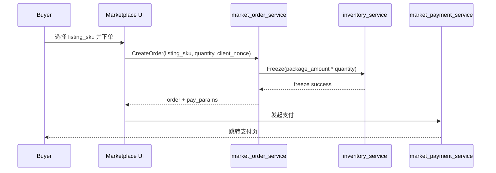
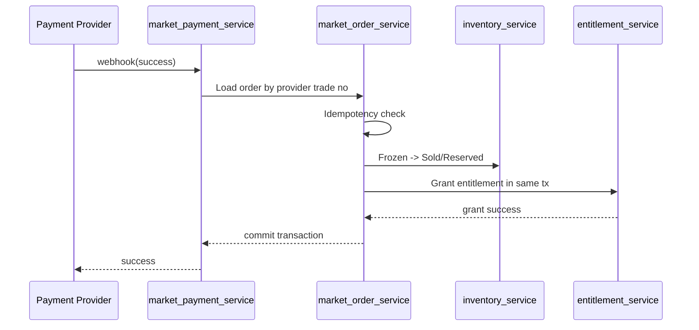
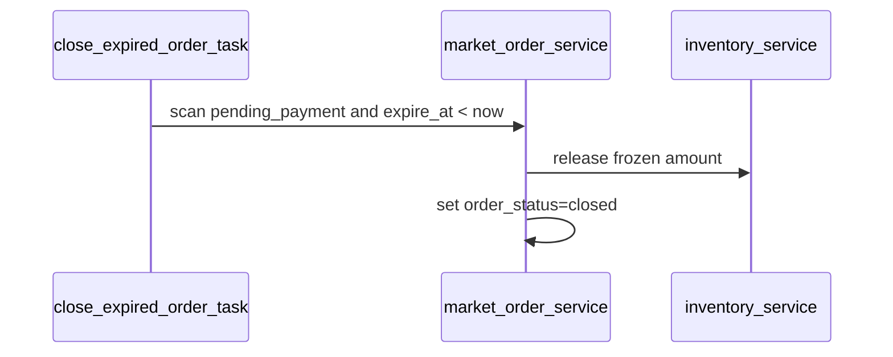

# 12-支付订单与权益发放时序设计

更新时间：2026-04-12

## 1. 文档目标

本文件将 `M1` 中从“买方下单”到“支付成功”到“entitlement 发放”的关键时序冻结到可指导编码的粒度。

本文件重点解决：

1. 订单到底何时创建
2. 库存何时冻结、何时释放、何时转已售
3. 支付同步返回与异步回调各自承担什么职责
4. entitlement 在什么事务边界内创建
5. 重复回调、乱序回调、超时关闭和发权失败如何处理

## 2. M1 适用边界

- 仅支持 `text/chat` 类模型
- entitlement 单位统一为 `token`
- `M1` UI 层按“单商品单 SKU 下单”实现
- 数据模型保留 `market_order_item`，但一张订单首期只允许一个有效订单项
- 支付成功后的核心落库与发权在服务端同步事务内完成
- 通知、站内信、统计刷新等副作用允许异步

## 3. 冻结决策

### 决策 A：订单在支付前创建

- 买方点击下单后立即创建 `market_order + market_order_item`
- 订单创建成功后再拉起支付
- 支付失败不删除订单，只进入关闭或失败状态

### 决策 B：库存在订单创建时冻结

- 冻结粒度是 `supply_account` 对应的 `inventory_snapshot`
- 冻结量 = `listing_sku.package_amount * quantity`
- 未支付订单必须占用 `FrozenAmount`

### 决策 C：同步支付返回只做体验，不做最终记账

- 买方支付页返回成功或失败仅用于前端提示
- 最终支付结果只认服务端异步回调
- 前端统一展示“支付处理中”并轮询订单状态

### 决策 D：支付成功与发权在同一事务中提交

- webhook 处理时，同一事务内完成：
  - 订单支付状态更新
  - inventory 冻结转已售
  - `buyer_entitlement` upsert
  - `entitlement_lot` 创建
- 如果事务失败，返回失败响应，让支付平台重试回调

### 决策 E：`M1` 不支持自动退款型补偿

- 支付成功但发权失败时，不走自动退款
- 优先依赖 webhook 重试和后台重放发权
- 如多次失败，转人工处理

## 4. 参与对象

- 买方
- Marketplace 页面
- `market_order_service`
- `market_payment_service`
- `inventory_service`
- `entitlement_service`
- 支付平台 webhook
- 后台补偿任务

## 5. 关键数据快照

订单创建时必须固化以下快照字段：

- `listing_id`
- `sku_id`
- `seller_id`
- `supply_account_id`
- `model_name`
- `package_amount`
- `package_unit`
- `unit_price_minor`
- `line_amount_minor`

原因：

- 避免支付完成后商品被改价、改模型、改卖家导致发权口径漂移
- 后续 entitlement、usage、settlement 都以订单项快照为准

## 6. 主时序

### 6.1 下单与拉起支付

下单事务必须完成：

1. 校验 `listing.status=active`
2. 校验 `listing.audit_status=approved`
3. 校验 `listing_sku.status=active`
4. 校验 `seller_secret/supply_account` 可用
5. 冻结库存
6. 创建订单与订单项
7. 返回支付所需参数

### 6.2 webhook 成功回调与发权

### 6.3 超时关闭

## 7. 状态轴与事务边界

## 7.1 创建订单后

- `order_status = pending_payment`
- `payment_status = unpaid`
- `entitlement_status = pending`

事务内更新：

- `inventory_snapshot.frozen_amount += package_amount`

## 7.2 支付拉起后

- 订单状态不改为 `paid`
- 允许写入：
  - `payment_method`
  - `payment_trade_no`
  - `payment_payload_snapshot`

## 7.3 回调成功后

同一事务内更新：

- `payment_status = paid`
- `order_status = paid`
- `paid_at = now`
- `entitlement_status = created`
- `inventory_snapshot.frozen_amount -= package_amount`
- `inventory_snapshot.sold_amount += package_amount`
- `supply_account.reserved_capacity += package_amount`
- `buyer_entitlement.total_granted += package_amount`
- 新建 `entitlement_lot`

## 7.4 回调失败或超时关闭后

同一事务内更新：

- `order_status = closed`
- `payment_status = failed` 或保持 `unpaid`
- `entitlement_status = pending`
- `close_reason = payment_failed/payment_timeout`
- `inventory_snapshot.frozen_amount -= package_amount`

## 8. 订单创建详细规则

## 8.1 幂等键

订单创建幂等键建议：

- `buyer_user_id + client_nonce`

落点建议：

- `market_order.idempotency_key`

效果：

- 买方重复点击支付不会生成多张待支付订单
- 前端刷新后可安全重试拉起支付

## 8.2 冻结公式

冻结量：

- `freeze_amount = listing_sku.package_amount * quantity`

`M1` 约束：

- `quantity` 只能为整数
- `package_unit` 必须是 `token`
- 一次下单只允许单个 `sku_id`

## 8.3 订单有效期

建议冻结：

- `expire_at = created_at + 15 minutes`

原因：

- 足够完成支付
- 避免长时间占用库存

## 9. 支付回调处理规则

## 9.1 支付成功回调幂等键

建议：

- `payment_provider + payment_trade_no + callback_type`

说明：

- Stripe 可直接使用 event id + payment intent id
- 其他渠道用 trade no + callback stage

## 9.2 回调顺序规则

- 异步回调先到，直接处理并更新订单
- 同步页面晚到，只读取订单当前状态
- 重复回调命中幂等键后直接返回成功
- 已经 `paid + created` 的订单再次回调，不允许重复发权

## 9.3 金额校验

回调处理前必须校验：

- `payable_amount_minor`
- `currency`
- `order_no / payment_trade_no`

任一不一致：

- 不更新订单
- 记录异常日志
- 返回失败或人工介入

## 10. entitlement 发放规则

## 10.1 发放动作

在回调成功事务内必须完成：

1. `buyer_entitlement` 按 `buyer_user_id + vendor_id + model_name` upsert
2. `entitlement_lot` 按 `order_item_id` 生成
3. `market_order_item.granted_amount = package_amount`

## 10.2 发放幂等键

建议：

- `order_no + order_item_id + grant_stage`

效果：

- 重复 webhook 不会重复创建 `entitlement_lot`
- 后台重放发权时仍可安全执行

## 10.3 entitlement lot 字段快照

发权时必须冻结：

- `buyer_user_id`
- `order_id`
- `order_item_id`
- `seller_id`
- `listing_id`
- `supply_account_id`
- `granted_amount`
- `expire_at`
- `priority_seq`

## 11. 补偿与重放矩阵

| 场景 | 处理方式 | 是否自动 | 结果要求 |
| --- | --- | --- | --- |
| webhook 重复到达 | 命中幂等键直接返回成功 | 是 | 不重复发权 |
| webhook 成功但本地事务失败 | 返回失败，让 PSP 重试 | 是 | 不产生半成功 |
| PSP 不再重试但订单仍未发权 | 后台重放 `GrantEntitlement` | 否 | 最终 `entitlement_status=created` |
| 订单超时未支付 | 定时任务关闭并释放冻结 | 是 | 不留脏冻结 |
| 明确支付失败 | 关闭订单并释放冻结 | 是 | 不发权 |

## 12. 异常场景冻结

## 12.1 同步返回成功，异步回调未到

- 页面显示 `支付处理中`
- 轮询 `GET /api/market/orders/:id`
- 不允许前端直接改订单为已支付

## 12.2 异步回调成功，但库存已被其他订单耗尽

- 由于库存在订单创建时已冻结，本订单仍然必须发权
- 如果冻结记录异常丢失，平台承担差异，并将相关商品置为 `paused`

## 12.3 回调乱序

- 如果先收到失败回调，后收到成功回调：
  - 只要订单仍未终态且金额校验通过，以成功回调为准
- 如果订单已 `paid + created`：
  - 任何失败回调均不得回滚已发权状态

## 12.4 支付成功但 entitlement 重放失败

- `payment_status=paid`
- `order_status=paid`
- `entitlement_status=failed`
- 后台必须可对单订单项重放

## 13. 任务与接口落点建议

建议文件：

- `service/market_order_service.go`
- `service/market_payment_service.go`
- `service/entitlement_service.go`
- `service/close_expired_order_task.go`
- `controller/market_order.go`
- `controller/market_payment.go`

建议接口：

- `POST /api/market/orders`
- `GET /api/market/orders`
- `GET /api/market/orders/:id`
- `POST /api/market/orders/:id/pay`
- `POST /api/market/payment/epay/notify`
- `POST /api/market/payment/stripe/webhook`
- `POST /api/market/payment/creem/webhook`
- `POST /api/market/payment/waffo/webhook`

## 14. 验收标准

满足以下条件时，本专题视为完成：

1. 下单时库存会冻结，且超时会释放
2. 异步回调是唯一最终支付确认来源
3. 支付成功与发权能在同一事务内提交
4. 重复回调不会重复发权
5. 发权失败可后台重放
6. 文档足以直接指导 `Task 3` 编码
