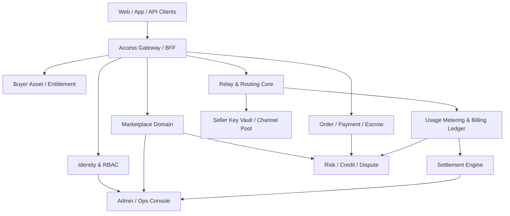

# AI Token 集市平台可实施落地方案总览

更新时间：2026-04-12

## 1. 结论先行

这不是一个“挑一个现成开源网关，改几个页面就上线”的项目，而是一个由四类系统叠加形成的平台：

1. 多上游 AI 网关与路由内核
2. 买卖双方交易市场
3. 实时计费、账务、结算与担保机制
4. 风控、争议、合规与运营后台

基于本地四个仓的源码和文档分析，推荐的底座策略是：

- 主底座：`new-api-main`
- UI 和 B/C 端产品体验参考：`coai-main`
- 路由治理、团队/预算/Guardrails 参考：`litellm-main`
- 当前 `one-api-main` 适合作为概念与兼容层参考，不建议作为本项目最终主底座继续演进

核心原因很简单：

- `new-api-main` 在 Go 单体、统一 Relay、用户/Token/渠道、充值/订阅/支付、后台运维这几块上最接近目标平台的“基础设施层”
- `coai-main` 很适合借鉴前台交互、运营体验和用户工作台，但其产品中心仍然是聊天 SaaS，而不是 C2C 额度交易市场
- `litellm-main` 的企业级路由与治理能力最强，但 Python 技术栈切换成本高，且离“交易市场、订单、结算、争议”太远

## 2. 候选底座结论

### 2.1 综合排序

| 候选项目 | 结论 | 适合承担的角色 |
| --- | --- | --- |
| `new-api-main` | 最适合做主底座 | 网关内核、用户体系、支付充值、额度与后台基础 |
| `coai-main` | 部分适合 | 前台体验参考、运营工作台参考、后续买方门户参考 |
| `litellm-main` | 不适合做主底座，但适合做能力参考 | 企业级路由、预算、Guardrails、审计与治理参考 |

### 2.2 为什么主底座选 `new-api-main`

从源码证据看，`new-api-main` 已经具备以下可直接复用能力：

- 单体分层架构，后端边界清晰：`docs/system-architecture.zh-CN.md`
- 用户、Token、Channel、Ability、Log、TopUp、Subscription 等核心实体：`docs/core-data-models.zh-CN.md`
- 充值、订阅、Relay 四条主业务链路文档已经成形：`docs/core-business-sequences.zh-CN.md`
- 控制器和模型层已存在 `topup`、`subscription`、`billing`、`token`、`channel`、`log` 等域对象
- 前后端都已经有运营后台与用户控制台，不需要从零搭管理系统

它缺的不是“网关能力”，而是“交易平台能力”。这意味着：

- 适合作为网关内核和资金基础设施起点
- 不适合作为完整产品直接上线
- 需要新增交易域、库存域、结算域、争议域

### 2.3 为什么不选 `coai-main` 做主底座

`coai-main` 的优点非常明显：

- UI 更成熟
- 用户工作台更像可运营产品
- 有订阅、支付、兑换码、钱包等产品化能力

但它的结构中心是“聊天 SaaS + API 分发”，不是“交易市场 + 账务清算”。

关键偏差在于：

- 商品市场更多是模型/套餐展示，不是卖家上架的可审核交易商品
- 缺乏卖家、商品、订单、结算、仲裁这些独立领域建模
- 平台业务语义偏 C 端订阅消费，不是多卖家供给市场

结论：

- 可以借鉴前端产品体验和部分运营模块
- 不建议作为本项目主干仓库

### 2.4 为什么不选 `litellm-main` 做主底座

`litellm-main` 在这些方面最强：

- 多模型支持面广
- Router、fallback、health check、budget、guardrails、audit 完整
- Teams、Projects、Virtual Keys、Spend Tracking 成熟

但它的问题也很明确：

- 与当前 Go 技术栈不连续
- 仓库规模和抽象层级很高，改造成本大
- 缺少交易市场、支付订单、卖家履约、结算仲裁等业务骨架

更适合的使用方式是：

- 作为路由治理设计样本
- 在后期企业版中借鉴其预算、审计、Guardrails 与团队治理模型
- 不作为第一阶段业务主底座

## 3. 推荐总体架构

推荐采用：

`模块化单体 + 专用 Relay 子系统 + 异步计费/结算流水 + 后续可拆分服务`

不建议一上来做微服务，原因是：

- 交易平台本身已足够复杂
- 当前最优底座 `new-api-main` 是单体分层架构
- 早期最大的风险来自领域建模错误，不是服务拆分不够

### 3.1 逻辑模块图

### 3.2 核心领域拆分

1. `identity`：用户、角色、卖家认证、2FA、审计
2. `seller`：卖家资料、KYC、店铺、保证金、合规状态
3. `catalog`：商品、SKU、价格、可售模型、保障等级、审核流
4. `inventory`：卖家密钥池、可售库存、健康状态、剩余额度
5. `order`：购物车、订单、支付、退款、担保态
6. `entitlement`：买家购买后获得的可用权益，不直接暴露上游密钥
7. `relay`：平台统一 API、路由策略、重试、失败隔离、健康检查
8. `metering`：预扣、实扣、请求日志、用量归集、退款修正
9. `settlement`：T+1 待结算、保障期冻结、解冻、卖家提现
10. `risk_dispute`：信用评分、异常检测、争议受理、裁决
11. `ops`：平台配置、监控、告警、运营报表

## 4. 关键设计原则

### 4.1 平台卖的是“使用权”，不是上游密钥

买方永远只拿到平台发放的 `Client Key`，不会拿到卖方真实 API Key。

这意味着：

- 平台必须有自己的 Relay 层
- 卖方密钥必须进密钥仓库存储
- 库存、权益、计费、风控全部围绕平台请求链路展开

### 4.2 三本账必须分离

建议明确拆成三类流水：

1. 供给账：卖家可售库存与密钥池状态
2. 权益账：买家购买后剩余可用权益
3. 用量账：真实请求产生的 token/请求次数/成本流水

否则后续会出现：

- 买家余额对不上
- 卖家可结算金额对不上
- 实际消耗与售卖承诺无法核对

### 4.3 风控和争议不是附属功能

对于这个平台，风控和仲裁不是锦上添花，而是交易可持续运行的前提：

- 没有信用与争议体系，卖家供给无法被平台定价
- 没有担保与保障期，买方无法接受“买了即用，出问题自己承担”
- 没有异常检测，平台会很快遇到薅羊毛、刷单、恶意请求和脏 key 问题

## 5. 现实的实施节奏

原需求文档中的 “MVP 4-6 周” 对完整平台来说偏乐观。

更现实的版本如下：

- `MVP-Lite`：6-8 周
  - 只做平台托管卖家、人工审核上架、固定价格商品
  - 不做自由竞价、保险、自动仲裁、卖家自助提现
  - 适合先跑通闭环验证
- `Pilot MVP`：12-16 周
  - 做完整购买、权益分配、Relay 计费、待结算、人工争议处理
  - 适合小范围商家和白名单用户试运行
- `Marketplace V1`：16-24 周
  - 开放多卖家、自助上架、信用分、自动冻结/解冻、完整后台与数据报表

## 6. 推荐团队配置

建议至少配置：

- 1 名技术负责人 / 架构负责人
- 2 名 Go 后端工程师
- 1 名全栈或前端工程师
- 1 名测试 / 自动化工程师
- 1 名产品 / 运营负责人（共享角色也可）

如果少于 4 名研发，建议只做 `MVP-Lite`。

## 7. 下一步建议

最建议的执行路径是：

1. 在 `new-api-main` 上创建正式实施分支或新工作树
2. 先做 Phase 0：领域模型和表设计冻结
3. 只做 `MVP-Lite` 范围，先跑通买方下单到平台代理调用的闭环
4. 试运行后再补卖家自助、信用分、争议自动化和复杂价格机制

详细内容见：

- `01-决策链路分析.md`
- `04-完整执行步骤.md`
- `05-异常处理方案.md`
- `07-ClawTeam_基于new-api-main的完整实施蓝图.md`
- `08-M0_领域模型与状态机详细设计.md`
- `09-M1_交易闭环开发任务书.md`
- `10-设计补强专题清单.md`
- `11-SellerKeyVault与密钥生命周期设计.md`
- `12-支付订单与权益发放时序设计.md`
- `13-entitlement路由分配与扣减算法设计.md`
- `14-库存口径超卖控制与自动停售规则设计.md`
- `15-Token与Entitlement绑定及资金源优先级设计.md`
