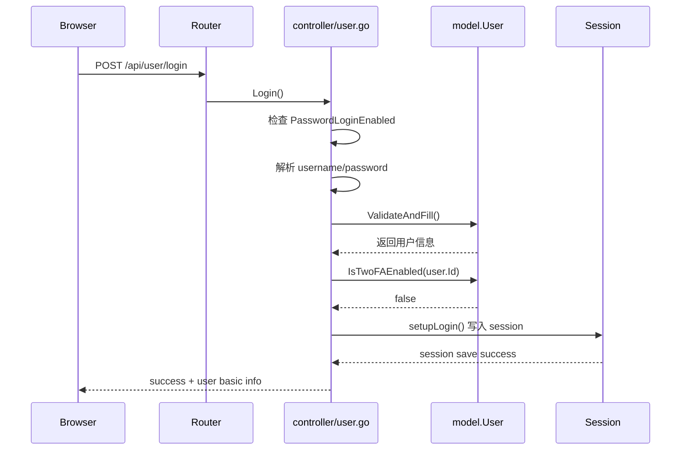
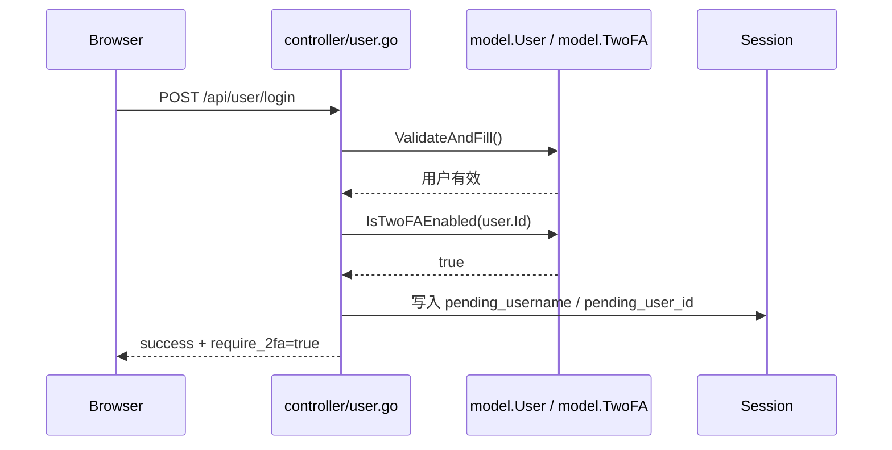
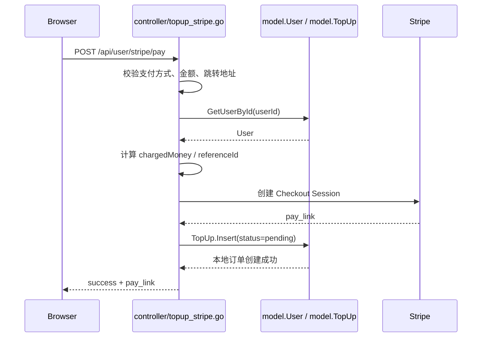
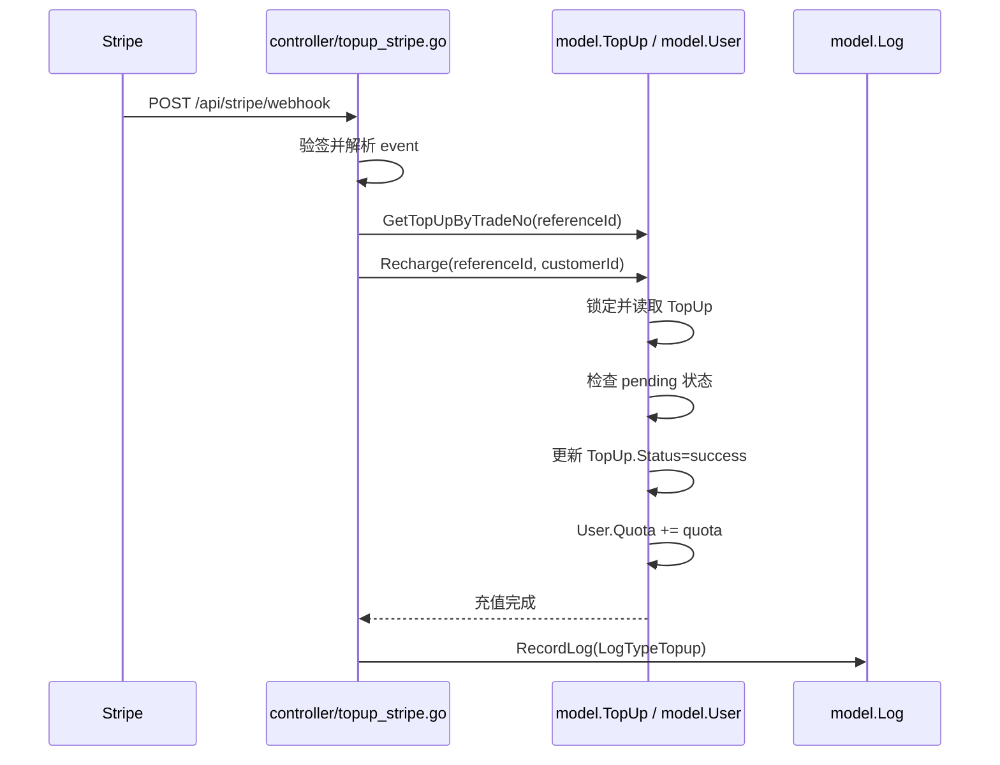
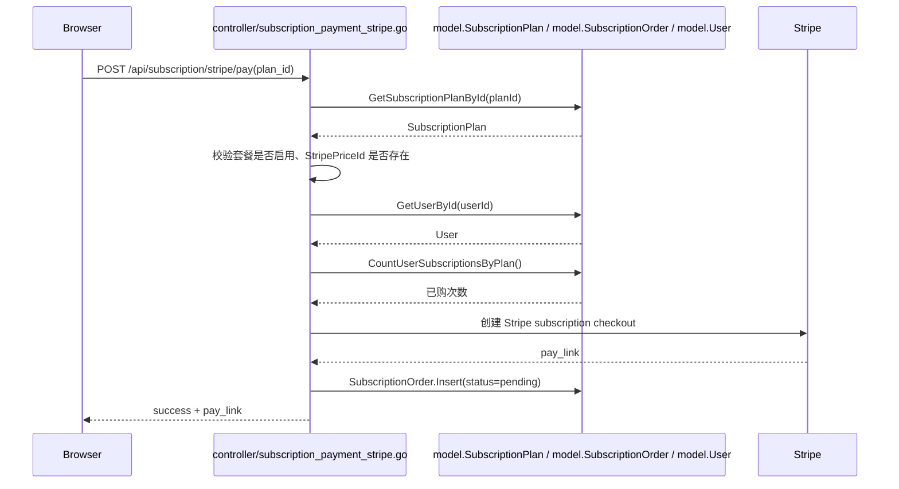
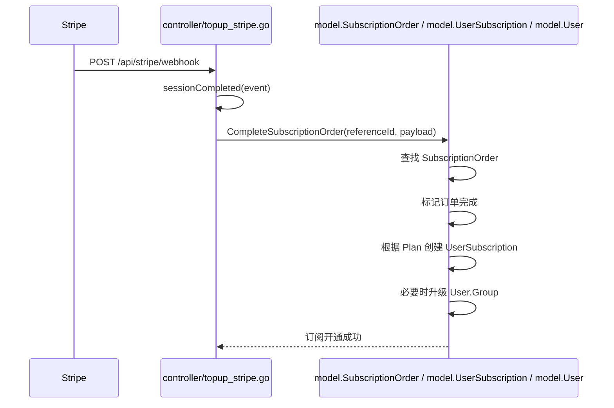
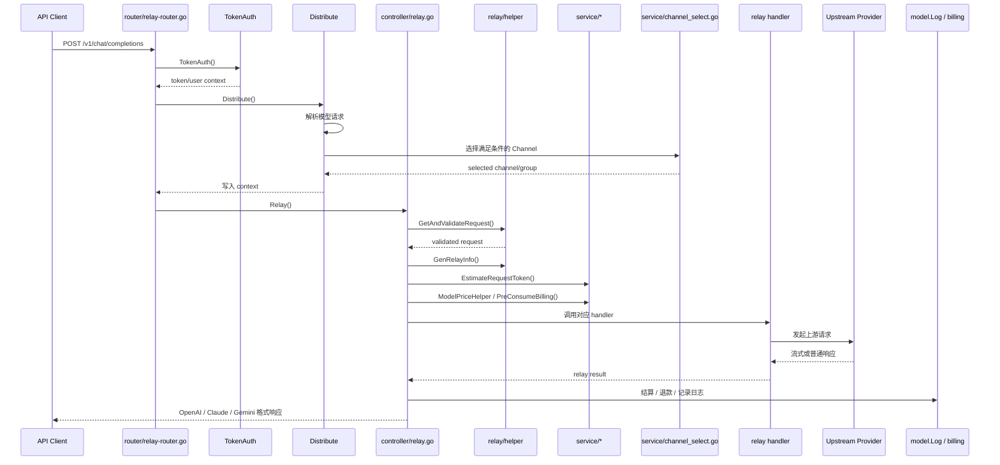
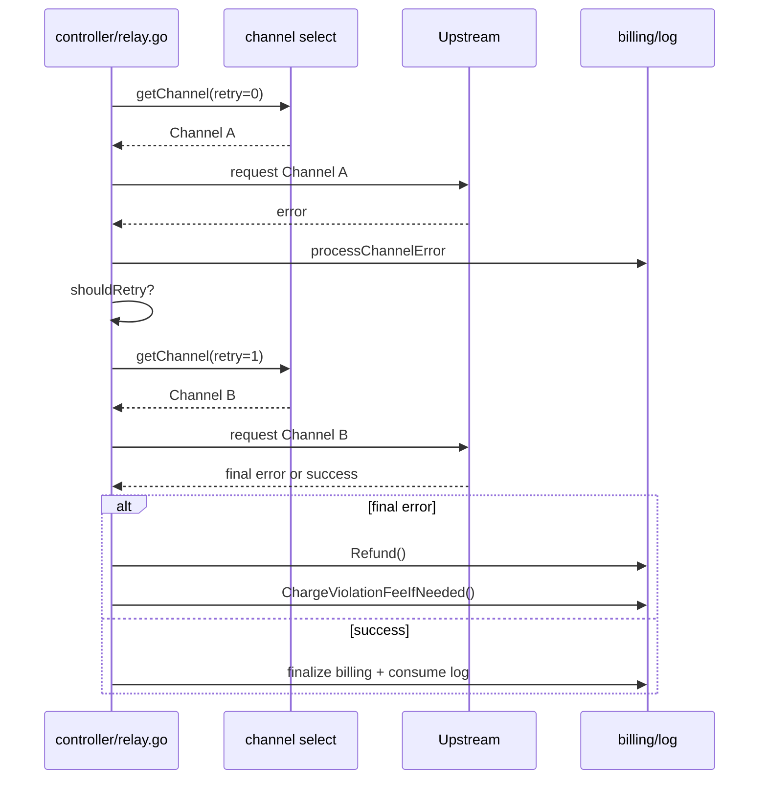

# 核心业务链路时序图

本文档把当前项目中最关键的 4 条业务链路整理成时序图，方便研发在定位流程、排查问题和设计改动时快速对齐。

包含的链路：

1. 登录
2. 充值
3. 订阅购买
4. Relay 调用

配套文档：

- `docs/project-feature-overview.zh-CN.md`
- `docs/system-architecture.zh-CN.md`
- `docs/developer-reading-guide.zh-CN.md`
- `docs/core-data-models.zh-CN.md`

## 1. 阅读说明

这些时序图是基于当前代码主流程抽象出来的“主干路径”，重点呈现：

- 请求经过哪些层
- 关键数据在哪里落库
- 哪一步会触发外部系统调用
- 哪一步会影响额度、订阅或日志

它们不是 100% 展示所有分支，而是帮助你快速建立流程骨架。

## 2. 登录链路

适用入口：

- `POST /api/user/login`

主代码入口：

- `controller/user.go`
- `model/user.go`
- `model/twofa.go`

### 2.1 普通密码登录

### 2.2 开启 2FA 的登录分支

### 2.3 登录链路要点

- 登录成功后，核心状态保存在 session 中，而不是直接返回完整用户对象
- 用户角色、状态、分组会进入 session，后续被 `middleware/auth.go` 使用
- 2FA 是登录链路中的一个分支，不是完全独立链路

## 3. 充值链路

适用入口：

- `POST /api/user/pay`
- `POST /api/user/stripe/pay`
- 其他支付方式结构类似

主代码入口：

- `controller/topup.go`
- `controller/topup_stripe.go`
- `model/topup.go`

### 3.1 发起充值订单

下面以 Stripe 充值为例，EPay/Waffo/Creem 的骨架类似。

### 3.2 支付回调完成充值

### 3.3 充值链路要点

- 支付链路采用“先本地下单，再第三方支付，再 webhook 回写”的模式
- 真实加额度发生在 webhook 完成时，不发生在前端点击支付时
- `TopUp` 是支付订单事实表，`User.Quota` 是最终账户余额

## 4. 订阅购买链路

适用入口：

- `POST /api/subscription/stripe/pay`
- `POST /api/subscription/epay/pay`
- `POST /api/subscription/creem/pay`

主代码入口：

- `controller/subscription.go`
- `controller/subscription_payment_stripe.go`
- `model/subscription.go`
- `controller/topup_stripe.go` 中 webhook 完成分支

### 4.1 发起订阅购买

### 4.2 支付回调完成订阅

### 4.3 订阅链路要点

- 订阅和充值共用部分支付基础设施，但落库对象不同
- 充值完成后主要影响 `User.Quota`
- 订阅完成后主要影响 `UserSubscription`，并可能影响 `User.Group`
- `SubscriptionOrder` 是支付订单，`UserSubscription` 是订阅实例

## 5. Relay 调用链路

适用入口：

- `/v1/chat/completions`
- `/v1/responses`
- `/v1/messages`
- `/v1beta/models/*`
- `/mj/*`
- `/suno/*`

主代码入口：

- `router/relay-router.go`
- `middleware/auth.go`
- `middleware/distributor.go`
- `controller/relay.go`
- `service/channel_select.go`
- `relay/*`

### 5.1 标准文本模型调用

下面以 `/v1/chat/completions` 为代表。

### 5.2 Relay 失败重试与退款分支

### 5.3 Relay 链路要点

- Relay 不是简单反向代理，而是带业务编排的调用引擎
- `Distribute()` 已经在 Controller 之前完成模型解析和渠道初筛
- Controller 中还会继续做：
  - 请求校验
  - Token 估算
  - 定价
  - 预扣费
  - 重试
  - 退款和违规费处理
- 实际上游差异主要收敛在 `relay/*_handler.go` 和 `relay/channel/*`

## 6. 四条链路的共同模式

从这 4 条链路里可以总结出项目的一些统一设计风格。

### 6.1 统一模式 1：先校验，再落库/转发

无论是登录、充值、订阅还是 Relay，都会先做：

- 配置开关校验
- 参数校验
- 权限或状态校验

### 6.2 统一模式 2：先记录本地事实，再依赖外部系统完成

充值和订阅都是：

- 本地创建 pending 订单
- 跳转第三方支付
- 通过 webhook 回写完成

### 6.3 统一模式 3：关键流程都有日志或账单结果

- 充值成功会写 topup log
- Relay 成功或失败会写 consume/error log
- 订阅完成会落订单和订阅实例

### 6.4 统一模式 4：核心状态依赖 context + DB

- 用户态接口依赖 session / access token
- Relay 依赖 middleware 注入的 context
- 长期业务状态最终落在 DB

## 7. 排查问题时怎么用这份文档

### 登录有问题

优先看：

- `controller/user.go`
- `model/user.go`
- `model/twofa.go`
- `middleware/auth.go`

### 支付成功但没加额度

优先看：

- `controller/topup_stripe.go`
- `controller/topup.go`
- `model/topup.go`

排查重点：

- webhook 是否成功到达
- `TopUp.Status` 是否仍是 pending
- `Recharge()` 是否执行成功

### 订阅支付成功但没生效

优先看：

- `controller/subscription_payment_stripe.go`
- `controller/topup_stripe.go`
- `model/subscription.go`

排查重点：

- `SubscriptionOrder` 是否存在
- webhook 完成时是走了订阅完成还是误走了充值完成
- `UserSubscription` 是否创建成功

### Relay 调用失败

优先看：

- `middleware/distributor.go`
- `controller/relay.go`
- `service/channel_select.go`
- 对应 `relay/*_handler.go`

排查重点：

- token 是否有效
- model 是否被允许
- 是否找到了满足条件的 channel
- 是否在预扣费、请求转换或上游适配阶段失败

## 8. 结论

这 4 条链路基本覆盖了项目最重要的运行骨架：

- 登录代表用户身份建立
- 充值代表钱包加值
- 订阅代表长期商业化流程
- Relay 代表平台核心调用引擎

如果后续还要继续补文档，最有价值的下一步通常是：

- 为这 4 条链路分别补“异常分支与排障清单”
- 或者再补一份“状态变更清单”，专门列出哪些表会在每条链路中被修改

