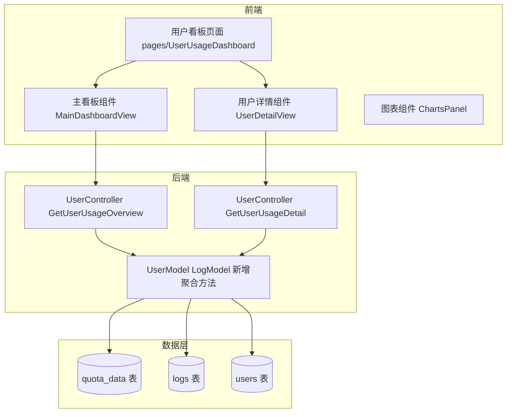

# 设计文档：用户用量统计看板

## 1. 需求概述

新增「用户用量看板」模块，为管理员提供以用户为维度的用量统计与资源消耗分析。参考现有「数据看板」的展示效果，但不改动任何现有代码。

### 1.1 功能需求

| 需求 | 描述 |
|------|------|
| **主看板** | 展示所有用户，按天/周/月汇总用量（调用次数、消耗额度、Token 用量） |
| **用户详情** | 点击用户后展示：模型消耗分布、时间消耗分布、失败调用统计 |
| **时间粒度** | 支持天、周、月三种聚合粒度 |

### 1.2 约束

- 不修改任何现有代码（仅新增文件与追加路由注册）
- 代码风格与现有代码一致
- 在侧边栏「管理员」区域新增菜单项
- 仅 Admin/Root 角色可访问

---

## 2. 现有数据源分析

### 2.1 `quota_data` 表（已存在）

| 字段 | 类型 | 说明 |
|------|------|------|
| `user_id` | int | 用户 ID |
| `username` | varchar(64) | 用户名 |
| `model_name` | varchar(64) | 模型名 |
| `created_at` | bigint | 时间戳（精确到小时） |
| `token_used` | int | Token 用量 |
| `count` | int | 调用次数 |
| `quota` | int | 消耗额度 |

**局限**：`created_at` 精确到小时级别，不含失败调用信息。已有按用户/模型/时间的聚合查询方法。

### 2.2 `logs` 表（已存在）

| 字段 | 类型 | 说明 |
|------|------|------|
| `user_id` | int | 用户 ID |
| `username` | varchar | 用户名 |
| `model_name` | varchar | 模型名 |
| `created_at` | bigint | 时间戳 |
| `type` | int | 日志类型（2=消费, 5=错误） |
| `quota` | int | 消耗额度 |
| `prompt_tokens` | int | 输入 Token |
| `completion_tokens` | int | 输出 Token |
| `use_time` | int | 耗时（秒） |
| `channel_id` | int | 渠道 ID |
| `content` | text | 内容/错误信息 |

**关键发现**：
- `type = 2` (LogTypeConsume) 表示成功消费日志
- `type = 5` (LogTypeError) 表示错误/失败日志
- `use_time` 字段可用于时间消耗分布分析

### 2.3 数据支持性评估

| 需求项 | 数据支持 | 来源 |
|--------|---------|------|
| 用户维度用量汇总 | ✅ 支持 | `quota_data` / `logs` |
| 按天/周/月聚合 | ✅ 支持 | 基于 `created_at` 聚合 |
| 模型消耗（次数/金额/Token） | ✅ 支持 | `quota_data` / `logs` |
| 时间消耗分布 | ✅ 支持 | `logs.use_time` |
| 调用失败统计 | ✅ 支持 | `logs.type = 5` |

**结论**：现有数据表可以支撑全部需求，无需新增数据表。

---

## 3. 架构设计

### 3.1 系统架构图



### 3.2 接口设计

#### 3.2.1 用户用量概览

```
GET /api/admin/usage/overview
权限：Admin/Root
```

| 参数 | 类型 | 必填 | 说明 |
|------|------|------|------|
| `start_timestamp` | int64 | 是 | 起始时间戳 |
| `end_timestamp` | int64 | 是 | 结束时间戳 |
| `granularity` | string | 否 | 聚合粒度：`day`(默认) / `week` / `month` |

**响应**：
```json
{
  "success": true,
  "data": [
    {
      "user_id": 1,
      "username": "user1",
      "display_name": "用户1",
      "total_count": 150,
      "total_quota": 50000,
      "total_tokens": 120000,
      "error_count": 5,
      "time_series": [
        { "timestamp": 1714003200, "count": 20, "quota": 8000, "tokens": 15000 },
        ...
      ]
    }
  ]
}
```

#### 3.2.2 用户用量详情

```
GET /api/admin/usage/detail
权限：Admin/Root
```

| 参数 | 类型 | 必填 | 说明 |
|------|------|------|------|
| `user_id` | int | 是 | 用户 ID |
| `start_timestamp` | int64 | 是 | 起始时间戳 |
| `end_timestamp` | int64 | 是 | 结束时间戳 |
| `granularity` | string | 否 | 聚合粒度：`day`(默认) / `week` / `month` |

**响应**：
```json
{
  "success": true,
  "data": {
    "summary": {
      "user_id": 1,
      "username": "user1",
      "total_count": 150,
      "total_quota": 50000,
      "total_tokens": 120000,
      "error_count": 5,
      "avg_use_time_ms": 1250
    },
    "model_distribution": [
      {
        "model_name": "gpt-4",
        "count": 80,
        "quota": 30000,
        "prompt_tokens": 50000,
        "completion_tokens": 40000,
        "error_count": 2
      }
    ],
    "time_distribution": [
      {
        "timestamp": 1714003200,
        "count": 20,
        "quota": 8000,
        "tokens": 15000,
        "avg_use_time_ms": 1100
      }
    ],
    "error_distribution": [
      {
        "model_name": "gpt-4",
        "error_content": "rate limit exceeded",
        "count": 3,
        "latest_at": 1714050000
      }
    ]
  }
}
```

### 3.3 数据模型

#### 3.3.1 新增 DTO 结构

```go
// dto/user_usage.go

// UserUsageOverview 用户用量概览
type UserUsageOverview struct {
    UserID       int              `json:"user_id"`
    Username     string           `json:"username"`
    DisplayName  string           `json:"display_name"`
    TotalCount   int              `json:"total_count"`
    TotalQuota   int              `json:"total_quota"`
    TotalTokens  int              `json:"total_tokens"`
    ErrorCount   int              `json:"error_count"`
    TimeSeries   []TimeSeriesItem `json:"time_series"`
}

// UserUsageDetail 用户用量详情
type UserUsageDetail struct {
    Summary           UserUsageSummary    `json:"summary"`
    ModelDistribution []ModelDistribution `json:"model_distribution"`
    TimeDistribution  []TimeSeriesItem    `json:"time_distribution"`
    ErrorDistribution []ErrorDistribution `json:"error_distribution"`
}

// UserUsageSummary 用量汇总
type UserUsageSummary struct {
    UserID      int    `json:"user_id"`
    Username    string `json:"username"`
    TotalCount  int    `json:"total_count"`
    TotalQuota  int    `json:"total_quota"`
    TotalTokens int    `json:"total_tokens"`
    ErrorCount  int    `json:"error_count"`
    AvgUseTimeMs int   `json:"avg_use_time_ms"`
}

// ModelDistribution 模型分布
type ModelDistribution struct {
    ModelName        string `json:"model_name"`
    Count            int    `json:"count"`
    Quota            int    `json:"quota"`
    PromptTokens     int    `json:"prompt_tokens"`
    CompletionTokens int    `json:"completion_tokens"`
    ErrorCount       int    `json:"error_count"`
}

// ErrorDistribution 错误分布
type ErrorDistribution struct {
    ModelName    string `json:"model_name"`
    ErrorContent string `json:"error_content"`
    Count        int    `json:"count"`
    LatestAt     int64  `json:"latest_at"`
}
```

---

## 4. 文件清单

### 4.1 后端新增文件

| 文件路径 | 说明 |
|---------|------|
| `dto/user_usage.go` | 用户用量 DTO 定义 |
| `model/user_usage.go` | 用户用量数据查询方法 |
| `controller/user_usage.go` | 用户用量 API 控制器 |

### 4.2 后端修改文件（仅追加，不修改现有代码）

| 文件路径 | 修改内容 |
|---------|---------|
| `router/api-router.go` | 新增 `/api/admin/usage` 路由组 |

### 4.3 前端新增文件

| 文件路径 | 说明 |
|---------|------|
| `web/src/pages/UserUsageDashboard/index.jsx` | 用户看板主页面 |
| `web/src/components/user-usage/MainDashboardView.jsx` | 主看板视图组件 |
| `web/src/components/user-usage/UserDetailView.jsx` | 用户详情视图组件 |
| `web/src/components/user-usage/ChartsPanel.jsx` | 图表组件 |
| `web/src/hooks/user-usage/useUserUsageData.js` | 数据管理 Hook |
| `web/src/hooks/user-usage/useUserUsageCharts.js` | 图表管理 Hook |
| `web/src/constants/user-usage.constants.js` | 常量定义 |

### 4.4 前端修改文件（仅追加）

| 文件路径 | 修改内容 |
|---------|---------|
| `web/src/App.jsx` | 新增 `/user-usage` 路由 |
| `web/src/components/layout/SiderBar.jsx` | 新增「用户看板」菜单项 |
| `web/src/helpers/render.jsx` | 新增侧边栏图标 case |

---

## 5. 关键技术要点

### 5.1 SQL 聚合策略

**概览查询**：使用 `quota_data` 表做主聚合（效率高），`logs` 表补充错误统计。

```sql
-- 用户用量概览
SELECT
    q.user_id,
    q.username,
    SUM(q.count) AS total_count,
    SUM(q.quota) AS total_quota,
    SUM(q.token_used) AS total_tokens
FROM quota_data q
WHERE q.created_at >= ? AND q.created_at <= ?
GROUP BY q.user_id, q.username
ORDER BY total_quota DESC
```

**详情查询**：使用 `logs` 表做多维度聚合。

```sql
-- 模型分布
SELECT
    model_name,
    SUM(CASE WHEN type = 2 THEN 1 ELSE 0 END) AS count,
    SUM(CASE WHEN type = 2 THEN quota ELSE 0 END) AS quota,
    SUM(CASE WHEN type = 2 THEN prompt_tokens ELSE 0 END) AS prompt_tokens,
    SUM(CASE WHEN type = 2 THEN completion_tokens ELSE 0 END) AS completion_tokens,
    SUM(CASE WHEN type = 5 THEN 1 ELSE 0 END) AS error_count
FROM logs
WHERE user_id = ? AND created_at >= ? AND created_at <= ?
GROUP BY model_name
```

### 5.2 时间粒度处理

在 SQL 层将 `created_at` 按粒度归一化：

| 粒度 | 归一化方式 |
|------|-----------|
| 天 | `created_at - (created_at % 86400)` |
| 周 | `created_at - (created_at % 604800)` |
| 月 | 通过日期函数提取 `YYYY-MM` |

### 5.3 性能考虑

- `quota_data` 表已有 `(user_id, created_at)` 和 `(username, created_at)` 索引
- `logs` 表已有 `(user_id, created_at)` 和 `(created_at, type)` 索引
- 大数据量场景下，详情查询可能较慢，需添加超时保护
- 前端限制最大时间跨度：概览不限，详情不超过 31 天

---

## 6. 前端设计

### 6.1 页面布局

```
┌─────────────────────────────────────────────────┐
│  用户用量看板                     [天/周/月] [搜索] │
├─────────────────────────────────────────────────┤
│  ┌───────────┐ ┌───────────┐ ┌───────────────┐ │
│  │ 总用户数   │ │ 总调用次数 │ │  总消耗额度    │ │
│  │    42     │ │   12,543  │ │   $1,234.56   │ │
│  └───────────┘ └───────────┘ └───────────────┘ │
├─────────────────────────────────────────────────┤
│  用户列表（可点击展开详情）                         │
│  ┌────┬────────┬──────┬────────┬──────┬───────┐ │
│  │用户│ 调用次数│ 额度  │ Token  │ 错误 │ 趋势图│ │
│  ├────┼────────┼──────┼────────┼──────┼───────┤ │
│  │user1│  1,234 │$123.4│  980K  │  2   │ ▁▂▃▅▇ │ │
│  │user2│    567 │ $45.6│  450K  │  0   │ ▂▃▄▆  │ │
│  └────┴────────┴──────┴────────┴──────┴───────┘ │
└─────────────────────────────────────────────────┘

点击用户后 → 详情弹窗/页面:
┌─────────────────────────────────────────────────┐
│  ← user1 用量详情                    [天/周/月]   │
├─────────────────────────────────────────────────┤
│  ┌───────────┐ ┌───────────┐ ┌───────────────┐ │
│  │ 调用次数   │ │ 消耗额度   │ │  平均耗时      │ │
│  │   1,234   │ │  $123.45  │ │    1.25s      │ │
│  └───────────┘ └───────────┘ └───────────────┘ │
├─────────────────────────────────────────────────┤
│  [模型分布] [时间趋势] [错误统计]                 │
│                                                   │
│  模型分布（饼图）：                                 │
│    gpt-4     ████████ 65%                        │
│    gpt-3.5   ████ 30%                            │
│    claude    ██ 5%                               │
│                                                   │
│  时间趋势（折线图）：                               │
│    ▁▂▃▅▇▆▅▃▂▁                                    │
│                                                   │
│  错误统计（表格）：                                 │
│    模型    │ 错误原因          │ 次数 │ 最近发生    │
│    gpt-4   │ rate limit      │   2  │ 10:30     │
└─────────────────────────────────────────────────┘
```

### 6.2 技术选型

- **图表库**：复用现有的 `@visx` 图表库（项目已使用）
- **UI 组件**：复用 `@douyinfe/semi-ui`（项目已使用）
- **状态管理**：使用 React Hooks（与现有代码风格一致）

---

## 7. 实现计划

| 阶段 | 内容 | 预计工时 |
|------|------|---------|
| 1. DTO 定义 | `dto/user_usage.go` | 0.5h |
| 2. 数据层 | `model/user_usage.go` 查询方法 | 2h |
| 3. 控制器 | `controller/user_usage.go` API 实现 | 1.5h |
| 4. 路由注册 | `router/api-router.go` 新增路由 | 0.5h |
| 5. 前端常量 | `user-usage.constants.js` | 0.5h |
| 6. 前端 Hook | `useUserUsageData.js` + `useUserUsageCharts.js` | 2h |
| 7. 前端组件 | 主看板 + 详情视图 + 图表组件 | 3h |
| 8. 路由&菜单 | App.jsx + SiderBar.jsx 集成 | 0.5h |
| 9. 联调测试 | 前后端联调 + 自测 | 2h |
| **合计** | | **~12.5h** |

---

## 8. 风险与限制

| 风险 | 说明 | 应对 |
|------|------|------|
| `quota_data` 精度 | 仅精确到小时，天级聚合完全够用，分钟级不支持 | 需求仅到天，无影响 |
| 日志数据量 | 大时间跨度下 `logs` 聚合查询可能慢 | 限制详情查询最大 31 天，利用索引 |
| 错误信息聚合 | `logs.content` 内容不一致可能导致错误分类过多 | 按 `model_name + content 前100字符` 分组 |

---

## 9. 需要确认的问题

1. **时间粒度的「周」定义**：按自然周（周一到周日）还是滚动 7 天？
2. **用户详情页面形式**：采用弹窗/抽屉还是独立页面？
3. **失败调用统计维度**：仅统计 `type=5` 的错误日志，还是也包含 `type=2` 中 quota=0 的情况？
4. **是否需要导出功能**：支持 CSV/Excel 导出用户用量数据？

---

## 10. 确认记录

| 问题 | 确认结果 |
|------|---------|
| 周聚合方式 | 滚动 7 天 + 日期区间查询，最长 31 天 |
| 详情页面形式 | 右侧抽屉（Drawer）展示 |
| 失败统计范围 | 所有异常（type != 2 的日志记录） |
| 数据导出 | CSV 格式（带 BOM，Excel 可直接打开中文） |

